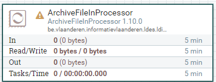

# Apache Nifi File In

<b>Apache Nifi processor name:</b> <i>```ArchiveFileInProcessor```</i>

<br>



The Archive File In is used to read the models from a file archive created by the [Archive File Out component](../ldi-outputs/file-archiving.md).

This component traverses all directories in the archive in lexical order and reads the members in lexical order as well.

Example expected structure:
- archive
  - 2022
    - 01
      - 01
        - member-1.nq
        - member-2.nq
        - ...
      - 02
        - member-122.nq
        - ...

```mermaid
graph LR
    I[archive-root-dir] --> L[LDES members]
    subgraph LDI pipeline file in
    I
    L
    end
```

## Config

| Property         | Description                       | Required | Default                     | Example          | Supported values                |
|:-----------------|:----------------------------------|:---------|:----------------------------|:-----------------|:--------------------------------|
| archive-root-dir | The root directory of the archive | Yes      | N/A                         | /parcels/archive | Linux (+ Mac) and Windows paths |
| source-format    | The source format of the files    | No       | Deduced from file extension | text/turtle      | Any Jena supported format       |

## Example
A complete demo of the archiving functionality with both LDIO and NiFi can be found in the [E2E repo](https://github.com/Informatievlaanderen/VSDS-LDES-E2E-testing/tree/main/tests/033.archiving)

{: .note }
The traversal order is **lexical**, this means that 1, 2, 3, ..., 9 should have leading zeroes. 
03 will be read before 10 but 3 will be read after 10.

{: .note }
Not all file extensions can be deduced automatically. Extensions like `.ttl` and `.nq` work fine and don't need a source-format specified.
When using LD+JSON, you will need to specify the source-format.