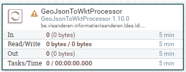
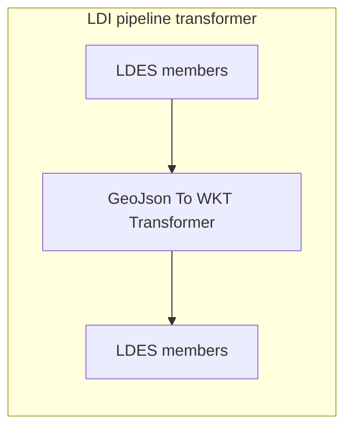

# Apache Nifi GeoJson To WKT Transformer

<b>Apache Nifi processor name:</b> <i>```GeoJsonToWKTProcessor```</i>

<br>



The GeoJson to Wkt Transformer will transform any GeoJson statements (with predicate https://purl.org/geojson/vocab#geometry) to a WKT string.

For example:
```json
{
  "https://purl.org/geojson/vocab#geojson:geometry": {
    "@type": "Point", 
    "https://purl.org/geojson/vocab#geojson:coordinates": [100.0, 0.0]
  }
}
```

becomes:

```json
{
  "http://www.w3.org/ns/locn#geometry": {
    "@value": "POINT (100 0)",
    "@type": "http://www.opengis.net/ont/geosparql#wktLiteral"
  }
}
```




## Config

This component has no required config
