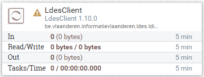

# Apache Nifi Ldes Client

<b>Apache Nifi processor name:</b> <i>```LDESClientProcessor```</i>

<br>



The LDES Client contains the functionality to replicate and synchronise an LDES, and to persist its state for that process.

This is achieved by configuring the processor with an initial fragment URL. When the processor is triggered, the fragment will be processed, and all relations will be added to the (non-persisted) queue. A queue that accepts new fragments to process is maintained as long as the processor runs. The processor also keeps track of the mutable and immutable fragments already processed.

It will be ignored when an attempt is made to queue a known immutable fragment. Fragments in the mutable fragment store will be queued when they’re expired. Should a fragment be processed from a stream that does not set the max-age in the Cache-control header, a default expiration interval will be used to set an expiration date on the fragment.

Processed members of mutable fragments are also kept in state. They are ignored if presented more than once. Within a fragment, members can be ordered based on a timestamp. The path to this timestamp has to be configured. If this path is missing, the members are ordered randomly.


```mermaid
graph LR
    L[LDES] --> H[LDES Client]
    H --> S[...]

    subgraph Apache Nifi input pipeline
    H
    end
```

## Config

| Property          | Description                                                                             | Required | Default             | Example                                                        | Supported values                                              |
| :---------------- | :-------------------------------------------------------------------------------------- | :------- | :------------------ | :------------------------------------------------------------- | :------------------------------------------------------------ |
| url               | The url of the LDES server                                                              | Yes      | N/A                 | http://localhost:8080/my-ldes                                  | HTTP and HTTPS urls                                           |
| Data source format  | The 'Content-Type' of the LDES | No       | application/ld+json | application/n-quads  | Any type supported by [Apache Jena](https://jena.apache.org/) |
| Data destination format | The 'Content-Type' that should be requested to the server | No       | application/ld+json | application/n-quads    | Any type supported by [Apache Jena](https://jena.apache.org/) |
| state             | 'sqlite', 'memory', 'file' or 'postgres' to indicate how the state should be persisted. | No       | memory              | sqlite                                                         | 'sqlite', 'files' or 'memory'                                 |
| keep-state        | Indicates if the state should be persisted on shutdown (n/a for in memory states)       | No       | false               | false                                                          | true or false                                                 |
| timestamp-path    | The property-path used to determine the timestamp on which the members will be ordered  | No       | N/A                 | http://www.w3.org/ns/prov#generatedAtTime                      | A property path                                               |
| postgres.url      | JDBC url of the Postgres database.                                                      | No       | N/A                 | jdbc:postgresql://test.postgres.database.azure.com:5432/sample | String                                                        |
| postgres.username | Username used to connect to Postgres database.                                          | No       | N/A                 | myUsername@test                                                | String                                                        |
| postgres.password | Password used to connect to Postgres database.                                          | No       | N/A                 | myPassword                                                     | String                                                        |

This component uses the "LDIO Http Requester" to make the HTTP request.
Refer to [LDIO Http Requester](../ldio-core) for the config.

## Examples

A simple setup using the LDES client in Apache Nifi is for example when this processor is linked to an RDF4JRepositoryMaterializationProcessor:

