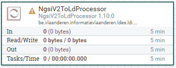
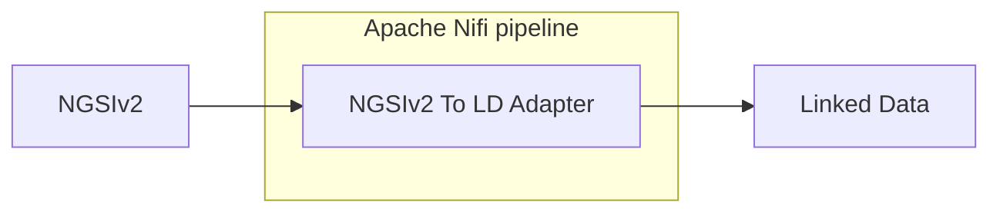

# Apache Nifi NGSIv2 To LD Adapter

<b>Apache Nifi processor name:</b> <i>```NgsiV2ToLdProcessor```</i>

<br>



This adapter will transform a NGSI V2 input into NGSI LD.




Jackson is used to first deserialize the input to java objects which can then be serialized to the LD format.

```
The algorithm applies several deviations from the standard formats. These deviations are:
1. The observedAt attribute is added to every property, its value is determined by the dateObserved attribute of the input.
2. The timestamp attribute of a metadata property normally determines the observedAt property but is ignored in this algorithm.
```

## Config

| Property        | Description                                      | Required | Default | Example                   | Supported values    |
| :-------------- | :----------------------------------------------- | :------- | :------ | :------------------------ | :------------------ |
| core-context    | URI of a core json-ld context.                   | Yes      | N/A     | http://example.com/my-api | HTTP and HTTPS urls |
| ld-context      | URI of a custom json-ld context.                 | No       | N/A     | http://example.com/my-api | HTTP and HTTPS urls |
| data-identifier | Identifier that points to data in provided json. | Yes      | N/A     | data                      | String              |
