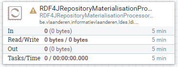
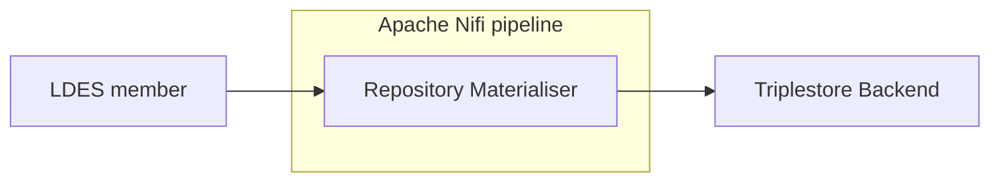

# Apache Nifi Repository Materialiser

<b>Apache Nifi processor name:</b> <i>```RepositoryMaterialiserProcessor```</i>

<br>



The repository materialiser is used to materialise an LDES stream into a triplestore.
Any triplestore that supports the RDF4J remote repository API can be used.



## Config

| Property      | Description                                  | Required | Default | Example                 | Supported values          |
| :------------ | :------------------------------------------- | :------- | :------ | :---------------------- | :------------------------ |
| sparql-host   | The url of the server hosting the repository | Yes      | N/A     | http://repositoryServer | URL                       |
| repository-id | The rdf4j repository id                      | Yes      | N/A     | repoId                  | String                    |
| named-graph   | The timestamp path used for naming the       | No       | N/A     | http://name             | Any valid LD subject name |
