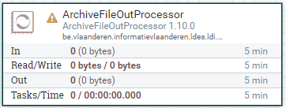
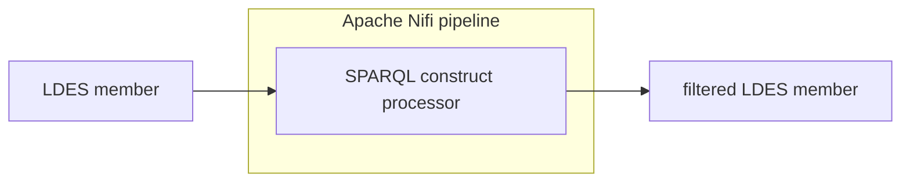

# Apache Nifi SPARQL Construct

<b>Apache Nifi processor name:</b> <i>```SparqlConstructProcessor```</i>

<br>





The SPARQL Construct Transformer will modify the model based on the given SPARQL Construct Query.

SPARQL Construct is a query language used in semantic Web technologies to create RDF (Resource Description Framework) graphs from existing RDF data. It allows users to specify a pattern of data they wish to extract from the RDF data and construct a new graph based on that pattern.

The SPARQL Construct query language provides a powerful way to create new RDF data by using existing input. It can be used to transform RDF data into different formats and simplify the structure of RDF data by aggregating or filtering data.

This SPARQL Construct Transformer building block can be used to execute model transformations.

Splitting models using SPARQL Construct
This component can be used to split models into multiple models using graphs. For example, the below query will create a dataset containing multiple models defined by 'GRAPH'. The SPARQL construct component will extract all named models from the dataset and add all statements from the default model. The component will then return a collection of models.

```
CONSTRUCT {
    GRAPH ?s {
        ?s ?p ?o
    }
}
WHERE { ?s ?p ?o }
```

## Config

| Property | Description                                              | Required | Default | Example  | Supported values |
| :------- | :------------------------------------------------------- | :------- | :------ | :------- | :--------------- |
| query    | Path to content of SPARQL Query/content of SPARQL query. | Yes      | N/A     | query.rq | Path/String      |
| infer    | Include original model in end result.                    | No       | false   | false    | true or false    |
| Data source format| data format of  the input source | no | application/n-quads | application/n-quads | application/n-quads, application/json-ld, TRIPPLE |