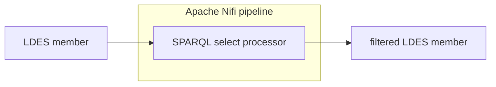

# Apache Nifi Pipeline SPARQL Select Processor

<b>Apache Nifi processor name:</b> <i>``SparqlSelectProcessor```</i>

<br>





## Config

| Property            | Description                                                     | Required | Default | Example  | Supported values |
| :------------------ | :-------------------------------------------------------------- | :------- | :------ | :------- | :--------------- |
| SPARQL Select Query | Path to content of SPARQL Query/content of SPARQL select query. | Yes      | N/A     | query.rq | Path/String      |
| Data source format  | SPARQL Select Query                                             | No       | false   | false    | true or false    |

query.rq:

```
SELECT {?subject ?predicate ?object} WHERE {?subject ?predicate ?object}
```
