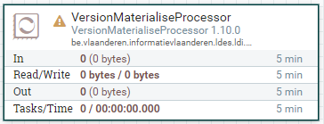
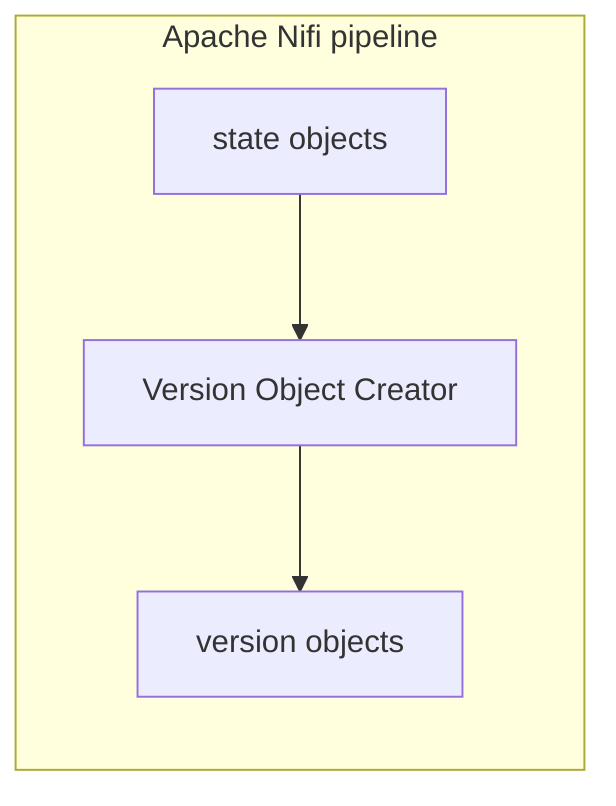

# Apache Nifi Version Object Creator

<b>Apache Nifi processor name:</b> <i>``VersionObjectCreatorProcessor```</i>

<br>



The Version Object Creator will transform a State Object to a Version Object.



## Config

| Property               | Description                                                                                                                    | Required | Default           | Example                                                             | Supported values |
| :--------------------- | :----------------------------------------------------------------------------------------------------------------------------- | :------- | :---------------- | :------------------------------------------------------------------ | :--------------- |
| date-observed-property | Property path (IRI format '<>') that points to a literal which should be used as timestampPath. Defaults to current timestamp. | No       | Current Timestamp | <https://uri.etsi.org/ngsi-ld/default-context/WaterQualityObserved> | String           |
| member-type            | Defines the RDF type of the version object                                                                                     | No       | N/A               | https://uri.etsi.org/ngsi-ld/default-context/Device                 | String           |
| delimiter              | Defines how the version object id will be constructed. (versionOf + delimiter + dateObserved)                                  | No       | /                 | /                                                                   | String           |
| generatedAt-property   | If defined, a statement will be added to the model with the observedAt value and the given property.                           | No       | N/A               | http://www.w3.org/ns/prov#generatedAtTime                           | String           |
| versionOf-property     | If defined, a statement will be added to the model with the versionOf value and the given property.                            | No       | N/A               | http://purl.org/dc/terms/isVersionOf                                | String           |

A property path can be provided for the date-observed-property.
For example for the following ttl:

<br>

```ttl
@prefix time: <http://www.w3.org/2006/time#> .
@prefix ex:   <http://example.org/> .
@prefix xsd: <http://www.w3.org/2001/XMLSchema#> .

ex:member
  a ex:Something ;
  ex:created [
    a time:Instant ;
    time:inXSDDateTimeStamp "2023-08-18T13:08:00+01:00"^^xsd:DateTime
  ] .
```

<br>

You can provide the following date-observed-property: "<http://example.org/created>/<http://www.w3.org/2006/time#inXSDDateTimeStamp>"
to select "time:inXSDDateTimeStamp" within "ex:created".
