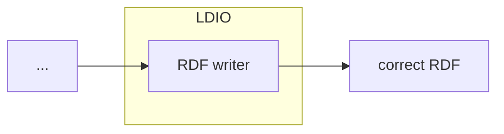

# LDIO Json To JsonLd Transformer

<b>LDIO Component Name:</b> <i>`Ldio:JsonToLdAdapter`</i>

<br>

An LDIO wrapper component for the [LDI Json To JsonLd building block](../../core/ldi-adapters/json-to-json-ld). The json-to-ld-adapter receives json messages and adds a linked data context to transform the messages to json-ld.



## Example

```yml
orchestrator:
  pipelines:
    - name: example
      adapter:
        name: Ldio:JsonToLdAdapter
        config:
          core-context: http://example.com/my-api
```

## Config

| Property     | Description                    | Required | Default | Example                   | Supported values    |
| :----------- | :----------------------------- | :------- | :------ | :------------------------ | :------------------ |
| core-context | URI of a core json-ld context. | Yes      | N/A     | http://example.com/my-api | HTTP and HTTPS urls |
