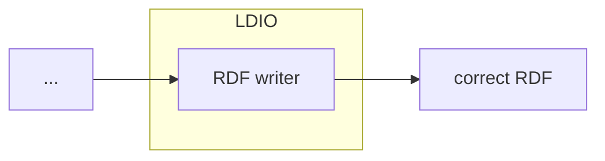

# LDIO RDF Adapter

<b>LDIO Component Name:</b> <i>`Ldio:RdfAdapter`</i>

<br>

An LDIO wrapper component for the [LDI RDF Adapter building block](../../core/ldi-adapters/rdf-adapter)



## Example

```yml
orchestrator:
  pipelines:
    - name: example
      adapter:
        name: Ldio:RdfAdapter
```

## Config

This component has no required config
