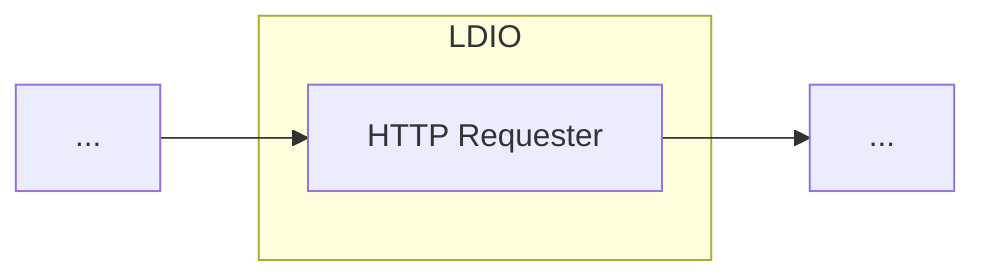

# LDIO Http Requester

Different LDIO components use the Http Requester to make HTTP requests.





## Example

```yaml
config:
  http:
    headers:
      - key: role
        value: developer
      - key: alt-role
        value: programmer
  auth:
    type: API_KEY
    api-key: my-secret
    api-key-header: x-api-key
  retries:
    enabled: true
    max: 10
    statuses-to-retry: 410,451
  rate-limit:
    enabled: true
    max-requests-per-minute: 500
```

## Retry

When retries are enabled, the following statuses are always retried, regardless of the configured statuses-to-retry:

- 5xx (500 and above)
- 429


## Config options

This requester supports the below config:

| Property                           | Description                                                                                      | Required | Default   | Example                     | Supported values                              |
| :--------------------------------- | :----------------------------------------------------------------------------------------------- | :------- | :-------- | :-------------------------- | :-------------------------------------------- |
| auth.type                          | The type of authentication required by the LDES server                                           | No       | NO_AUTH   | OAUTH2_CLIENT_CREDENTIALS   | NO_AUTH, API_KEY or OAUTH2_CLIENT_CREDENTIALS |
| auth.api-key                       | The api key when using auth.type 'API_KEY'                                                       | No       | N/A       | myKey                       | String                                        |
| auth.api-key-header                | The header for the api key when using auth.type 'API_KEY'                                        | No       | X-API-KEY | X-API-KEY                   | String                                        |
| auth.client-id                     | The client identifier when using auth.type 'OAUTH2_CLIENT_CREDENTIALS'                           | No       | N/A       | myId                        | String                                        |
| auth.client-secret                 | The client secret when using auth.type 'OAUTH2_CLIENT_CREDENTIALS'                               | No       | N/A       | mySecret                    | String                                        |
| auth.token-endpoint                | The token endpoint when using auth.type 'OAUTH2_CLIENT_CREDENTIALS'                              | No       | N/A       | http://localhost:8000/token | HTTP and HTTPS urls                           |
| retries.enabled                    | Indicates if the http client should retry http requests when the server cannot be reached.       | No       | true      | true                        | true or false                                 |
| retries.max                        | Max number of retries the http client should do when retries.enabled = true                      | No       | 5         | 100                         | Integer                                       |
| retries.statuses-to-retry          | Custom comma seperated list of http status codes that can trigger a retry in the http client.    | No       | N/A       | 410,451                     | Comma seperated list of Integers              |
| rate-limit.enabled                 | Indicates if the http client should limit http requests when calling the server.                 | No       | false     | false                       | true or false                                 |
| rate-limit.max-requests-per-minute | Max number of requests per minute the http client should do when rate-limit.enabled = true       | No       | 500       | 500                         | Integer                                       |
| http.headers.[].key/value          | A list of custom http headers can be added. A key and value has to be provided for every header. | No       | N/A       | role                        | String                                        |
