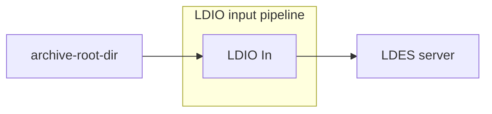

# LDIO In

<b>LD Pipeline Component Name:</b> <i>`Ldio:LdioArchiveFileIn`</i>

<br>

The LDIO Archive File In is used to read models from files and feed them to the pipeline.
Please refer to the [core documentation](../../core/ldi-inputs/file-archiving.md) for more information.



## Example

```yml
input:
  name: Ldio:LdioArchiveFileIn
  config:
    archive-root-dir: /parcels/archive
    source-format: text/turtle
```

## Config options

| Property         | Description                       | Required | Default                     | Example          | Supported values                |
| :--------------- | :-------------------------------- | :------- | :-------------------------- | :--------------- | :------------------------------ |
| archive-root-dir | The root directory of the archive | Yes      | N/A                         | /parcels/archive | Linux (+ Mac) and Windows paths |
| source-format    | The source format of the files    | No       | Deduced from file extension | text/turtle      | Any Jena supported format       |
