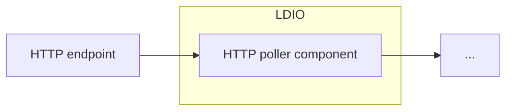

# LDIO HTTP In Poller

<b>LDIO Component Name:</b> <i>`Ldio:LdioHttpInPoller`</i>

<br>

The LDIO HTTP In Poller is a basic HTTP Poller that will poll a target URL on a specified interval. This component fetches data from an HTTP endpoint at a configured interval.

It is designed to process input in various content types, including XML (text/xml, application/xml), JSON (application/json), and RDF (text/turtle, application/ld+json, application/n-quads, application/n-triples, application/rdf+xml).

The expected output of the component is in these same formats, supporting XML, JSON, and RDF content types.



## Example

```yml
orchestrator:
  pipelines:
    - name: example
      input:
        name: Ldio:LdioHttpInPoller
        config:
          url: https://data.stad.gent/api/explore/v2.1/catalog/datasets/real-time-bezetting-pr-gent/exports/csv?lang=en&timezone=Europe%2FBrussels
          cron: 0 * * * * *
```

## Config options

| Property       | Description                                                   | Required | Default | Example                   | Supported values                                                                                                                                      |
| :------------- | :------------------------------------------------------------ | :------- | :------ | :------------------------ | :---------------------------------------------------------------------------------------------------------------------------------------------------- |
| url            | Target URL to poll from.                                      | Yes      | N/A     | http://example.com/my-api | HTTP and HTTPS urls (lists are supported)                                                                                                             |
| cron           | Cron expression to declare when the polling should take place | Yes[^1]  | N/A     | _/10 _ \* \* \* \*        | [Spring Cron Expression](https://docs.spring.io/spring-framework/docs/current/javadoc-api/org/springframework/scheduling/support/CronExpression.html) |
| interval       | Polling interval declared in ISO 8601 format.                 | Yes[^1]  | N/A     | PT1S                      | ISO 8601 formatted String                                                                                                                             |
| continueOnFail | Indicated if continue if polling results in failure           | No       | true    | true                      | true or false                                                                                                                                         |

This component uses the "LDIO Http Requester" to make the HTTP request.
Refer to [LDIO Http Requester](../ldio-core) for the config.

The Http In Poller supports polling multiple endpoints. Example configuration:

```yaml
name: Ldio:LdioHttpInPoller
config:
  auth:
    type: API_KEY
    api-key: my-key
    api-key-header: X-API-Key
  url:
    - https://webhook.site/6cb49dd1-aa05-4e77-8870-f06903805b30
    - https://webhook.site/e8078b99-4b09-496d-baa8-8ba309dec6b6
  interval: PT3S
```

When using multiple endpoints, the other config (auth config, interval, etc.) applies to all endpoints.

---

[^1]: Either choose the 'cron' option or the 'interval'. However, **the interval property will become deprecated**.
