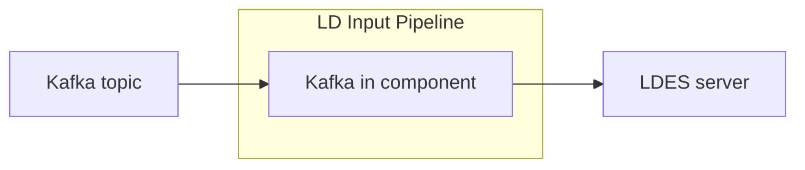

# LDIO Kafka In

<b>LDIO Component Name:</b> <i>`Ldio:LdioKafkaIn`</i>

<br>

The LDIO Kafka In component is vital to the LD INPUT PIPELINE, specifically designed to interact with Kafka, a distributed event streaming platform. This component is responsible for listening to messages from a specified [kafka topic](https://kafka.apache.org), which is crucial in integrating with an LDES server.



## Example

### NO SECURITY

```yaml
orchestrator:
  pipelines:
    - name: example
      outputs:
        - name: Ldio:LdioKafkaIn
          config:
            content-type: application/n-quads
            topics: quickstart-events
            bootstrap-servers: localhost:9092
            group-id: testing_group
```

### SASL SSL PLAIN

```yaml
outputs:
  - name: Ldio:LdioKafkaOut
    config:
      content-type: application/n-quads
      topics: quickstart-events
      bootstrap-servers: localhost:9092
      group-id: testing_group
      security-protocol: SASL_SSL_PLAIN
      sasl-jaas-user: client
      sasl-jaas-password: client-secret
```

## Config options

| Property           | Description                                                         | Required | Default | Example                          | Supported values                                                                     |
| ------------------ | ------------------------------------------------------------------- | -------- | ------- | -------------------------------- | ------------------------------------------------------------------------------------ |
| content-type       | Any content type supported by Apache Jena                           | Yes      | N/A     | application/n-quads              | String                                                                               |
| bootstrap-servers  | Comma separated list of uris of the bootstrap servers               | Yes      | N/A     | localhost:9012                   | url                                                                                  |
| topic              | Name of the topic                                                   | Yes      | N/A     | quickstart-events                | String                                                                               |
| key-property-path  | Optional property path to extract the kafka key from the data model | No       | null    | <http://purl.org/dc/terms/title> | [ARQ property path](https://jena.apache.org/documentation/query/property_paths.html) |
| security-protocol  | Security protocol to be used to connect to the kafka broker         | No       | NO_AUTH | SASL_SSL_PLAIN                   | SASL_SSL_PLAIN or NO_AUTH                                                            |
| sasl-jaas-user     | Username used in the security protocol                              | No       | null    | client                           | String                                                                               |
| sasl-jaas-password | Password used in the security protocol                              | No       | null    | secret                           | String                                                                               |
