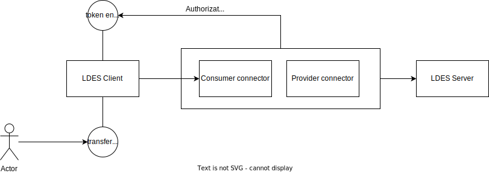

# LDIO Ldes Client Connector

***Ldio:LdesClientConnector***

An EDC (Eclipse dataspace Connector) LDIO wrapper component for [the ldio ldes client](./ldio-ldes-client) to add EDC
support to this component. If you'd like to know how to configure the LDES Client, we refer
to [the ldio ldes client](./ldio-ldes-client).
The additional functionality provided by this component makes it possible to use the Ldes Client to consume an LDES
through an EDC connector.
This component exposes two endpoints:

1. http://<host>:<port>/<pipelines.name>/transfer
   The Ldio component will start the data transfer with the connector. You have to send the transfer request to
   the LdioLdesClientConnector instead of the EDC consumer connector. The LDIO Ldes Client Connector will start the
   transfer
   with the connector and also keep the transfer alive while consuming the LDES (e.g. request a new token when it
   expires).
2. http://<host>:<port>/<pipelines.name>/token
   This endpoint should never be called directly. This is the callback to be provided in the transfer request.
   The EDC connector will use this callback endpoint to provide the LDES Client with a token.



## Config

| Property                 | Description                                                                                                     | Required | Default      | Example                                                         | Supported values    |
|:-------------------------|:----------------------------------------------------------------------------------------------------------------|:---------|:-------------|:----------------------------------------------------------------|:--------------------|
| _connector-transfer-url_ | The transfer url of the EDC connector which has to be called to start a transfer                                | Yes      | N/A          | http://consumer-connector:29193/management/v2/transferprocesses | HTTP and HTTPS urls |
| _proxy-url-to-replace_   | Makes it possible to proxy a part of the url of the LDES**. Indicates which part of the url should be replaced. | No       | empty string | http://ldes-behind-connectors.dev                               | string              |
| _proxy-url-replacement_  | Makes it possible to proxy a part of the url of the LDES**. Indicates the replacement url part.                 | No       | memory       | http://consumer-connector:29193                                 | string              |

** The url mentioned here are the actual url's used by the LDES Server (hostname). These are included in the results
bodies to indicate relations, etc. This is a temporary solution until the client and server support relative urls.

## Examples

```yaml
input:
  name: Ldio:LdesClientConnector
  config:
    url: http://consumer-connector:29291/public
    connector-transfer-url: http://consumer-connector:29193/management/v2/transferprocesses
    proxy-url-to-replace: http://localhost:8081/devices
    proxy-url-replacement: http://consumer-connector:29291/public
    source-format: application/n-quads
```

## INIT phase

Contrary to the other ldio-input components, the connector waits in the INIT status for the edc-token and will only
progress to the RUNNING status once it has received this token.
More on the statuses in ldio can be found [here.](../pipeline-management/pipeline-status)

## Pausing

When paused, this component will stop processing the current fragment and not make any calls to the server.
When resumed, it will continue with the fragment where it stopped and continue as normal.
This component can not be paused while waiting for the token.