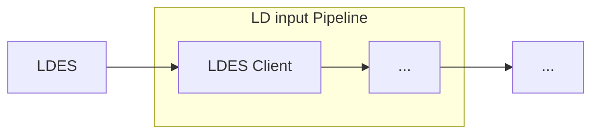

# LDES Client

<b>LDIO Component Name:</b> <i>`Ldio:LdioLdesClient`</i>

<br>

The <b>LDES Client</b> stands as a critical component of the LDIO, arguably the most pivotal. The LDES Client is responsible for consuming members from an existing LDES, subsequently facilitating their smooth progression through the LDIO. The LDES Client contains the functionality to replicate and synchronize an LDES, and to persist its state for that process. More information on the functionalites can be found [here][VSDS Tech Docs].

This is achieved by configuring the processor with an initial fragment URL. When the processor is triggered, the fragment will be processed, and all relations will be added to the (non-persisted) queue.A queue that accepts new fragments to process is maintained as long as the processor runs. The processor also keeps track of the mutable and immutable fragments already processed.

It will be ignored when an attempt is made to queue a known immutable fragment. Fragments in the mutable fragment store will be queued when they're expired. Should a fragment be processed from a stream that does not set the max-age in the Cache-control header, a default expiration interval will be used to set an expiration date on the fragment.

Processed members of mutable fragments are also kept in state. They are ignored if presented more than once.

Within a fragment, members can be ordered based on a timestamp. The path to this timestamp has to be configured. If this path is missing, the members are ordered randomly.

[VSDS Tech Docs]: https://informatievlaanderen.github.io/VSDS-Tech-Docs/introduction/LDES_client



## Example

```yml
- name: client-pipeline
  description: "Requests all existing members from a public LDES server and keeps following it for changes, sending each member as-is to a webhook"
  input:
    name: Ldio:LdioLdesClient
    config:
      url: ${LDES_SERVER_URL}
      sourceFormat: application/n-quads
      state: false
      keep-state: false
      timestamp-path: https://www.w3.org/ns/prov#generatedAtTime
```

```yaml
input:
  name: Ldio:LdioLdesClient
  config:
    url: http://localhost:8080/my-ldes
    sourceFormat: text/turtle
    retries:
      enabled: true
    auth:
      type: OAUTH2_CLIENT_CREDENTIALS
      client-id: clientId
      client-secret: secret
      token-endpoint: http://localhost:8000/token
```

```yaml
input:
  name: Ldio:LdioLdesClient
  config:
    url: http://localhost:8080/my-ldes
    sourceFormat: text/turtle
    retries:
      enabled: true
    state: postgres
    postgres:
      url: jdbc:postgresql://test.postgres.database.azure.com:5432/sample
      username: myUsername@test
      password: myPassword
```

## Config options

| Property          | Description                                                                             | Required | Default             | Example                                                        | Supported values                                              |
| :---------------- | :-------------------------------------------------------------------------------------- | :------- | :------------------ | :------------------------------------------------------------- | :------------------------------------------------------------ |
| url               | The url of the LDES server                                                              | Yes      | N/A                 | http://localhost:8080/my-ldes                                  | HTTP and HTTPS urls                                           |
| source-format     | The 'Content-Type' that should be requested to the server.                              | No       | application/ld+json | application/n-quads                                            | Any type supported by [Apache Jena](https://jena.apache.org/) |
| state             | 'sqlite', 'memory', 'file' or 'postgres' to indicate how the state should be persisted. | No       | memory              | sqlite                                                         | 'sqlite', 'files' or 'memory'                                 |
| keep-state        | Indicates if the state should be persisted on shutdown (n/a for in memory states)       | No       | false               | false                                                          | true or false                                                 |
| timestamp-path    | The property-path used to determine the timestamp on which the members will be ordered  | No       | N/A                 | http://www.w3.org/ns/prov#generatedAtTime                      | A property path                                               |
| postgres.url      | JDBC url of the Postgres database.                                                      | No       | N/A                 | jdbc:postgresql://test.postgres.database.azure.com:5432/sample | String                                                        |
| postgres.username | Username used to connect to Postgres database.                                          | No       | N/A                 | myUsername@test                                                | String                                                        |
| postgres.password | Password used to connect to Postgres database.                                          | No       | N/A                 | myPassword                                                     | String                                                        |

This component uses the "LDIO Http Requester" to make the HTTP request.
Refer to [LDIO Http Requester](../ldio-core) for the config.
