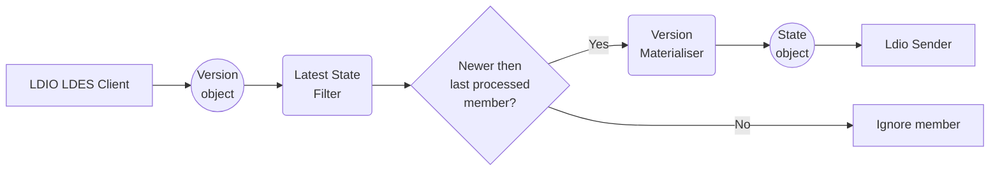

# LDIO LDES Client

The LDES Client is a component which can be used by data consumers to replicate and synchronize an LDES.  
When replication or synchronization is halted, the LDES Client is able to resume where it has stopped. More information
on how consumption of an LDES works can be
found [here](https://informatievlaanderen.github.io/VSDS-Tech-Docs/introduction/LDES_client).

## Processing fragments

One or more URLs need to be configured in the LDES Client. If more URLs are configured, they need to be part of the same
LDES.  
The configured fragments (URLs) will be processed and all relations will be added to the (non-persisted) queue.  
As long as the LDES Client runs, new fragments that need to be processed can be added to the queue.
The LDES Client will keep track of the mutable and immutable fragments it did already process. When an immutable
fragment that already has been processed is added to the queue, it will be ignored.

Mutable fragments usually have a `max-age` set in the Cache-control header. If this isn't the case, a default expiration
interval will be used to set an expiration date on the fragment.
When the `max-age` or default expiration interval of a fragment expires, the fragment will be put into the queue again
so that the LDES Client fetches it again.

### Processing members within fragments

The LDES Client keeps track of the processed members of mutable fragments, to make sure members are only processed once
within a fragment.
When the fragment is marked as immutable, and no members can be added anymore, the LDES Client will stop keeping track
of members processed within that fragment.

Members within a fragment can be processed in order of time based on a timestamp. The path to this timestamp needs to be
configured.  
If the patch is missing, members will be processed in random order.

### Filtering

#### Exactly-once-filter

To have the possibility to filter out already received members, the "exactly-once-filter" can be enabled in
[configuration](#general-properties). The filter will check whether a member was already processed in other fragments.  
The IDs of all processed members will be remembered by the filter and when a duplicate member is processed, it will be
filtered out before sending it to the output of the Client.

#### Latest-state-filter

When version materialisation is enabled, state objects that does not represent the latest state can be filter out by
enabling the "latest-state-filter" in the [configuration](#version-materialisation-properties).

Both the versionOf and the timestamp of the version object members will be remembered by the filter. When a new member
with the same versionOf and a timestamp that is before or equal to the latest remembered timestamp, the member will be
filtered out. When a member is processed that has a later timestamp than the last remembered member, that last
remembered member will be overwritten and the new member will be processed.

_Flow of the Latest State Filter_



{: .note }
This Latest State Filter is only available for the version materialiser within the LDIO LDES Client, not for the
transformer component

### Persistence strategies

The Client offers different ways to persist state of the processed members:

| Strategy     | Description                                                 | Advantages                                                                                                        | Disadvantages                                                                                                                                        |
|:-------------|:------------------------------------------------------------|:------------------------------------------------------------------------------------------------------------------|:-----------------------------------------------------------------------------------------------------------------------------------------------------|
| _Memory_     | Store the state of members in the memory of the LDES Client | {::nomarkdown}<ul><li>Fastest processing</li><li>Easiest setup</li></ul>{:/}                                      | {::nomarkdown}<ul><li>Not suitable for large datasets (>500k), heap will overflow</li><li>State is lost when the client stops/restarts</li></ul>{:/} |
| _SQLite_     | A SQLite database is used to store state of members         | {::nomarkdown}<ul><li>Easy setup</li><li>State is not lost between runs</li></ul>{:/}                             | {::nomarkdown}<ul><li>Slowest processing**</li></ul>{:/}                                                                                             |
| _PostgreSQL_ | A PostgreSQL database is used to store state of the members | {::nomarkdown}<ul><li>Fastest processing for larger datasets</li><li>State is not lost between runs</li></ul>{:/} | {::nomarkdown}<ul><li>Database is needed</li></ul>{:/}                                                                                               |

** We use a transaction for every processed record and SQLite is limited by the
CPU ([source](https://www.sqlite.org/faq.html#q19)).

## Config

### General properties

| Property              | Description                                                                                                                                 | Required | Default     | Example                                   | Supported values                                                                                                        |
|:----------------------|:--------------------------------------------------------------------------------------------------------------------------------------------|:---------|:------------|:------------------------------------------|:------------------------------------------------------------------------------------------------------------------------|
| _urls_                | List of URLs of the LDES data sources                                                                                                       | Yes      | N/A         | http://localhost:8080/my-ldes             | HTTP and HTTPS URLs                                                                                                     |
| _source-format_       | The 'Content-Type' that should be requested to the server                                                                                   | No       | text/turtle | application/n-quads                       | Any type supported by [Apache Jena](https://jena.apache.org/documentation/io/rdf-input.html#determining-the-rdf-syntax) |
| _state_               | 'memory', 'sqlite' or 'postgres' to indicate how the state should be persisted                                                              | No       | memory      | sqlite                                    | 'memory', 'sqlite' or 'postgres'                                                                                        |
| _keep-state_          | Indicates if the state should be persisted on shutdown (n/a for in memory states)                                                           | No       | false       | false                                     | true or false                                                                                                           |
| _timestamp-path_      | The property-path used to determine the timestamp on which the members will be ordered, and used for the `latest-state-filter` when enabled | No       | N/A         | http://www.w3.org/ns/prov#generatedAtTime | A property path                                                                                                         |
| _enable-exactly-once_ | Indicates whether a member must be sent exactly once or at least once                                                                       | No       | true        | true                                      | true or false                                                                                                           |

{: .note }
The default `source-format` is `text/turtle`, as this RDF format supports relative URIs. However, if relative URIs are
not used, `application/n-quads` or even the binary format `application/rdf+protobuf` are better options, as these
formats are faster to parse.

{: .note }
Setting the keep-state property to `true` makes it so that the state can not be deleted through the pipeline-management
api

### Version materialisation properties

| Property                              | Description                                                                           | Required | Default                              | Example                              | Supported values |
|:--------------------------------------|:--------------------------------------------------------------------------------------|:---------|:-------------------------------------|:-------------------------------------|:-----------------|
| _materialisation.enabled_             | Indicates if the client should return state-objects (true) or version-objects (false) | No       | false                                | true                                 | true or false    |
| _materialisation.version-of-property_ | Property that points to the versionOfPath                                             | No       | http://purl.org/dc/terms/isVersionOf | http://purl.org/dc/terms/isVersionOf | true or false    |
| _materialisation.enable-latest-state_ | Indicates whether all state or only the latest state must be sent                     | No       | true                                 | false                                | true or false    |

{: .note }
Don't forgot to provide a timestamp-path in the general properties, as this property is not required, but necessary for
this filter to work properly!



### SQLite properties

| Property           | Description                                   | Required | Default | Example      | Supported values |
|:-------------------|:----------------------------------------------|:---------|:--------|:-------------|:-----------------|
| _sqlite.directory_ | Directory wherein the `.db` file can be saved | No       | N/A     | /ldio/sqlite | String           |

### Postgres properties

| Property            | Description                                   | Required | Default | Example                                                        | Supported values |
|:--------------------|:----------------------------------------------|:---------|:--------|:---------------------------------------------------------------|:-----------------|
| _postgres.url_      | JDBC URL of the Postgres database             | No       | N/A     | jdbc:postgresql://test.postgres.database.azure.com:5432/sample | String           |
| _postgres.username_ | Username used to connect to Postgres database | No       | N/A     | myUsername@test                                                | String           |
| _postgres.password_ | Password used to connect to Postgres database | No       | N/A     | myPassword                                                     | String           |

### Configuration Examples

```yaml
  input:
    name: Ldio:LdesClient
    config:
      urls:
        - http://localhost:8080/my-ldes
      sourceFormat: text/turtle
      materialisation:
        enabled: true
      retries:
        enabled: true
      auth:
        type: OAUTH2_CLIENT_CREDENTIALS
        client-id: clientId
        client-secret: secret
        token-endpoint: http://localhost:8000/token
```

```yaml
  input:
    name: Ldio:LdesClient
    config:
      urls:
        - http://localhost:8080/my-ldes
      sourceFormat: text/turtle
      retries:
        enabled: true
      state: postgres
      postgres:
        url: jdbc:postgresql://test.postgres.database.azure.com:5432/sample
        username: myUsername@test
        password: myPassword
```

## Pausing the LDES Client

- When paused, the LDES Client will stop processing the current fragment and will not request new fragments from the
  server.
- When resumed, the LDES Client will continue processing the fragment where it has stopped and it will request new
  fragments form the server.