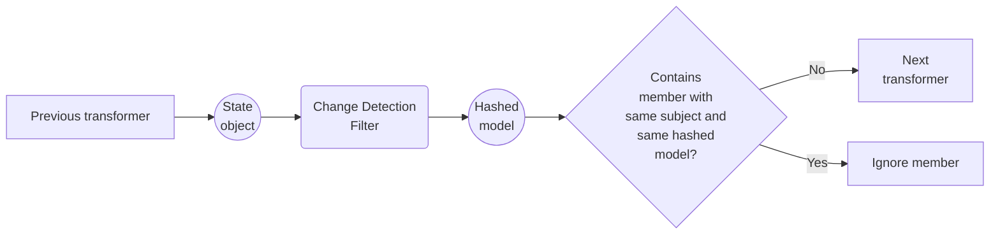

# LDIO Change Detection Filter

***Ldio:ChangeDetectionFilter***

The LDIO Change Detection Filter, which is in fact a transformer, keeps track of each member with the same subject if
the state has changed. If not, the member will be ignored, otherwise the member will be sent further through the
pipeline. This can come in handy when you do not want to spam your server for example with duplicate state objects.

**Flow of the Change Detection Filter**

## Config

### General properties

| Property     | Description                                                                       | Required | Default | Example | Supported values                 |
|:-------------|:----------------------------------------------------------------------------------|:---------|:--------|:--------|:---------------------------------|
| _state_      | 'memory', 'sqlite' or 'postgres' to indicate how the state should be persisted    | No       | memory  | sqlite  | 'memory', 'sqlite' or 'postgres' |
| _keep-state_ | Indicates if the state should be persisted on shutdown (n/a for in memory states) | No       | false   | false   | true or false                    |

### SQLite properties

| Property           | Description                                   | Required | Default | Example      | Supported values |
|:-------------------|:----------------------------------------------|:---------|:--------|:-------------|:-----------------|
| _sqlite.directory_ | Directory wherein the `.db` file can be saved | No       | N/A     | /ldio/sqlite | String           |

### Postgres properties

| Property            | Description                                   | Required | Default | Example                                                        | Supported values |
|:--------------------|:----------------------------------------------|:---------|:--------|:---------------------------------------------------------------|:-----------------|
| _postgres.url_      | JDBC URL of the Postgres database             | No       | N/A     | jdbc:postgresql://test.postgres.database.azure.com:5432/sample | String           |
| _postgres.username_ | Username used to connect to Postgres database | No       | N/A     | myUsername@test                                                | String           |
| _postgres.password_ | Password used to connect to Postgres database | No       | N/A     | myPassword                                                     | String           |
