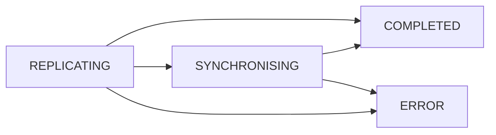

# LDES Client Status

Just like the LDIO pipelines have a status, so does the [`Ldio:LdesClient`](../ldio-inputs/ldio-ldes-client). The client
status can be fetched when a pipeline that has a running status, and of course when it contains an LDES client as input
component.

## Overview Of The Status Flow

The above diagram shows the flow between the different statuses of the client.

## REPLICATING

The startup status of the client. This status indicates that the LDES client have not yet fetched all the available
fragments of a view (or views if so configured)

## SYNCHRONISING

This status indicates that all the fragments of the configured view(s) have been fetched at least once, and there is at
least one fragment that does not have an immutable state yet.

## ERROR

This status indicates that an error has occurred somewhere while `REPLICATING` or `SYNCHRONISING`

## COMPLETED

This status indicates that all the fragments of the configured view has been fetched at least once and all those have an
immutable state, or in other words, the end of the LDES has been reached.
